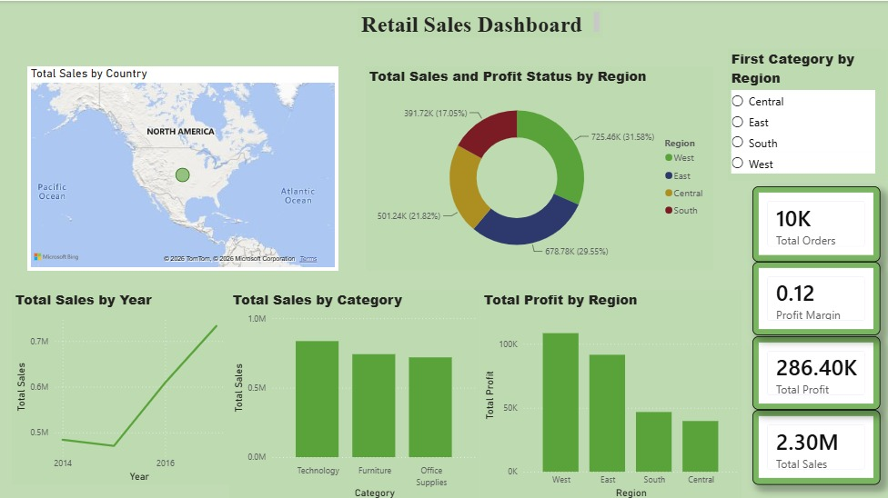

# 📊 Retails Sales Analysis

## 🔷 Project Overview

This project focuses on analyzing retail sales data to uncover business insights and improve decision-making. The analysis was performed using **Excel, SQL and Power BI**.

---

## 🛠 Tools & Technologies Used

* Microsoft Excel
* SQL Server
* Power BI

---

## 📁 Dataset

The dataset used for this project was downloaded from Kaggle:

🔗 https://www.kaggle.com/datasets/vivek468/superstore-dataset-final

It contains detailed information about sales, profit, customers, regions, and products.

---

## 🧹 Data Cleaning (Excel)

Before analysis, data cleaning was performed in Excel:

* Removed duplicates
* Handled missing (NULL) values
* Corrected data formats (Date, Numbers)
* Ensured consistency in column names

---

## 🗄 SQL Analysis

Performed data analysis using SQL queries:

* Total record count
* Total Sales calculation
* Total Profit calculation
* Category-wise sales analysis
* Top 5 regions by sales

---

## 📊 Power BI Dashboard

An interactive dashboard was created with the following features:

* KPI Cards (Total Sales, Total Profit, Total Orders, Profit Margin)
* Sales trend over time (Line Chart)
* Category-wise sales (Bar Chart)
* Region-wise sales (Bar Chart)
* Profit by Sub-Category (Donut Chart)
* Map visualization (Sales by Country)
* Slicers (Region, Category, Year)

---

## 📷 Dashboard Preview

### Dashboard 1 - Retail Sales Analysis



---

## 🔍 Key Insights

* Technology category generates the highest profit
* Some states show high sales but low profit
* Discounts negatively impact overall profit
* Sales trends vary across different time periods

---

## 📁 Project Structure
```
├── Dashboard/
        ├── Page1.png
        
├── Superstore_Cleaned.csv

├── Superstore.sql

├── project1.pbix

└── README.md
```
